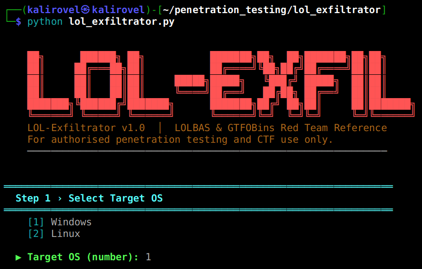

# LOL-Exfiltrator

A Python CLI tool that generates clear and obfuscated commands using Windows (LOLBAS) and Linux (GTFOBins) binaries.

## Preview



## Features

- 34 built-in techniques (15 Windows + 19 Linux)
- 12 obfuscation methods
- Supports Download, Upload, and Persistence actions
- Interactive and non-interactive modes
- Colored terminal output

## Setup

```bash
pip install colorama
```

## Usage

```bash
# Interactive mode
python lol_exfiltrator.py

# Non-interactive
python lol_exfiltrator.py --os windows --action download --ip 10.10.10.10 --port 8080 --filename shell.exe

# Filter by binary
python lol_exfiltrator.py --os linux --action upload --ip 10.0.0.1 --port 4444 --filename loot.zip --binary nc

# List all techniques
python lol_exfiltrator.py --list
```

## Project Structure

```
lol_exfiltrator/
├── lol_exfiltrator.py        # Main CLI
├── commands/
│   ├── windows_lolbas.py     # Windows commands
│   └── linux_gtfobins.py     # Linux commands
└── core/
    ├── obfuscator.py         # Obfuscation engine
    └── display.py            # Output formatting
```

## Disclaimer

For authorized testing and educational use only.
